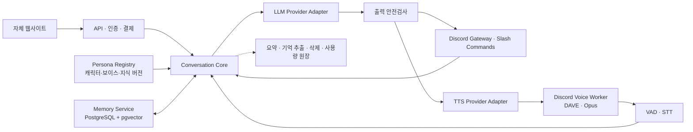

# Discord Anime AI

자체 웹사이트와 Discord 봇으로 제공하는 한국어 AI 캐릭터 대화 서비스입니다. 텍스트 채팅과 음성 채팅은 하나의 대화·기억 엔진을 공유하며, 캐릭터와 목소리는 데이터로 추가·교체할 수 있습니다.

## 제품 결정

- Discord 봇 빌더나 외부 챗봇 서비스가 아닌 **자체 웹사이트 + 자체 Discord 봇**으로 구축한다.
- 웹사이트는 서버 관리자가 Discord 로그인 후 캐릭터, 기억, 음성, 사용량, 구독을 관리하는 대시보드가 된다.
- 초기 음성은 외부 유료 TTS API 대신 GitHub의 무료 오픈소스 엔진을 로컬/자체 서버에서 실행한다.
- MVP에는 기본 한국어 합성 음성과 영어 여성 캐릭터 음성 한 개를 사용한다. 영어 여성 기본 음성은 실제 인물의 음성을 복제하지 않는 `Kokoro-82M`의 `af_heart`로 한다. 캐릭터별 추가 목소리, 음성팩, 커스텀 보이스는 제품 안정화 이후에 추가한다.
- 원본 음성은 기본 저장하지 않는다. 전사문·장기기억은 사용자의 명시적 동의가 있을 때만 보관한다.
- 유명 애니 캐릭터·성우를 흉내 내는 음성은 사용하지 않는다. 이후 커스텀 보이스도 권리자 동의와 라이선스 증빙이 있는 음성만 등록한다.

## MVP 범위

### 웹사이트

- 서비스 소개, 이용약관, 개인정보 처리방침
- Discord OAuth 로그인
- 서버 선택 및 봇 초대
- 서버별 기본 캐릭터 선택
- 기억 동의·조회·삭제·내보내기
- 음성방 상태와 사용량 확인
- 월/연 구독과 크레딧 구매

### Discord 봇

- `/chat`, 봇 멘션, DM 기반 텍스트 대화
- `/character select`, `/voice join`, `/voice leave`
- `/memory on`, `/memory off`, `/memory list`, `/memory forget`
- 일반 Voice Channel 한 곳에서만 동작하는 음성 대화
- 한 번에 한 명의 발화를 처리하고, 사용자가 다시 말하면 봇 TTS를 중단한다.

## 권장 구조



텍스트와 음성은 아래의 공통 입력 형식으로 합쳐진다. 이렇게 해야 캐릭터, 안전 정책, 기억 규칙이 채널에 따라 달라지지 않는다.

```ts
type TurnEnvelope = {
  eventId: string;
  guildId?: string;
  channelId?: string;
  userId: string;
  conversationId: string;
  modality: 'text' | 'voice';
  canonicalText: string;
  occurredAt: string;
  sttConfidence?: number;
};
```

## 초기 음성 선택

| 역할 | 초기 선택 | 이유 | 이후 대체/확장 |
| --- | --- | --- | --- |
| 음성 인식(STT) | `faster-whisper` | MIT 라이선스, CPU/GPU 양쪽 지원, VAD 필터 연동 가능 | GPU 모델·스트리밍 정책 개선 |
| 한국어 음성 합성(TTS) | `MeloTTS` | MIT 라이선스, 한국어 지원, CPU 실시간 추론을 목표로 설계 | 고품질 보이스 프로필 |
| 영어 여성 캐릭터 음성 | `Kokoro-82M` (`af_heart`) | Apache-2.0 코드·가중치, 82M 경량 모델, 미국 영어 여성 기본 보이스 | 영어 보이스 프로필 확장 |
| 고품질 다국어 보이스 | `Chatterbox Multilingual` | MIT 라이선스, 한국어 포함 다국어 지원 | 안정화 후 선택적 도입 |

초기 기본값은 **MeloTTS의 제공 한국어 음성**이다. 코드 라이선스는 MIT이고 상업 사용을 허용한다고 명시되어 있으며, 한국어를 지원한다. 다만 실제 배포 전에 내려받는 모델 파일의 모델 카드·가중치 라이선스와 버전 SHA를 `THIRD_PARTY_NOTICES.md`에 기록한다. [MeloTTS](https://github.com/myshell-ai/MeloTTS)

영어 여성 캐릭터의 초기 기본값은 **Kokoro-82M의 `af_heart`**다. `af`는 미국 영어 여성 보이스 계열이며, `af_heart`는 공식 사용 예시에 포함된 기본 보이스다. 실제 인물의 음성 참조 파일 없이 동작하므로 캐릭터 초기값으로 사용한다. Kokoro는 코드와 가중치가 Apache-2.0 라이선스이지만, 배포 전에 사용할 패키지·가중치 버전과 고지 사항을 `THIRD_PARTY_NOTICES.md`에 함께 기록한다. Kokoro의 지원 언어에 한국어는 포함되지 않으므로 한국어 요청은 MeloTTS로 라우팅한다. [Kokoro](https://github.com/hexgrad/kokoro)

`faster-whisper`는 MIT 라이선스의 Whisper 실행 엔진이며 Silero VAD 필터도 통합할 수 있다. 운영 환경에서는 한국어 샘플로 정확도와 지연시간을 측정한 뒤 `small`, `medium`, `large-v3` 중 모델 크기를 정한다. [faster-whisper](https://github.com/SYSTRAN/faster-whisper)

제품 안정화 후에는 [Chatterbox Multilingual](https://github.com/resemble-ai/chatterbox)을 보이스 어댑터로 추가할 수 있다. 이 프로젝트는 MIT 라이선스이며 한국어를 포함한 다국어를 지원한다. 다만 음성 참조 파일을 이용하는 보이스 복제 기능은 기본 비활성화한다. 권리자의 서면 동의, 사용 지역·기간, 철회·삭제 절차가 확인된 음성만 보이스 프로필에 연결한다.

### 음성 어댑터 계약

캐릭터가 TTS 엔진에 직접 의존하지 않도록 다음 인터페이스만 사용한다.

```ts
type VoiceProfile = {
  id: string;
  version: number;
  provider: 'melotts' | 'kokoro' | 'chatterbox';
  language: 'ko' | 'en-US';
  settings: Record<string, string | number | boolean>;
  status: 'draft' | 'published' | 'disabled';
};

interface TtsProvider {
  synthesize(input: {
    text: string;
    voiceProfile: VoiceProfile;
    abortSignal?: AbortSignal;
  }): Promise<ReadableStream<Uint8Array>>;
}
```

MVP는 아래 두 프로필만 게시한다. 후속 보이스 추가는 `voice_profiles`와 `voice_profile_versions`에 새 데이터를 등록하고, 테스트와 권리 검토를 통과한 뒤 게시한다. 캐릭터는 `voice_profile_version_id`만 참조한다.

```yaml
- id: default-ko-v1
  provider: melotts
  language: ko

- id: en-female-heart-v1
  provider: kokoro
  language: en-US
  settings:
    voice: af_heart
    speed: 0.95
```

## Discord 음성 처리

Discord 음성은 일반 Gateway와 분리된 Voice WebSocket·UDP 연결을 사용한다. DAVE E2EE 지원은 현재 일반 음성 채널 연결의 전제 조건이다. [`@discordjs/voice`](https://discord.js.org/docs/packages/voice/stable)는 현재 DAVE 라이브러리를 포함하지만, Discord가 오디오 수신을 공식 문서화하지 않아 안정 지원을 보장하지 않는다고 밝힌다. 그러므로 `apps/voice-worker` 외부에 음성 프로토콜 코드를 퍼뜨리지 않는다.

음성 MVP 처리 순서:

1. `/voice join`으로 명시적으로 입장한다.
2. 참가자에게 AI 음성 처리·보존 정책을 알리고 동의를 받는다.
3. 사용자별 Opus 스트림을 받아 PCM으로 변환한다.
4. VAD로 무음을 제외하고 STT로 전사한다.
5. 전사문을 공통 대화 엔진에 전달한다.
6. 완성된 답변을 안전검사 후 TTS로 생성한다.
7. 48kHz Opus로 변환해 Discord에 송출한다.
8. 새 발화가 시작되면 현재 TTS를 취소한다.

OpenAI moderation은 오디오 자체를 분류하지 않으므로, 음성은 전사 후 입력 검사하고 TTS 직전에는 생성 텍스트를 다시 검사한다. [OpenAI Moderation](https://developers.openai.com/api/docs/guides/moderation)

## 페르소나와 장기기억

캐릭터는 코드가 아닌 불변 버전 데이터로 관리한다.

```yaml
id: luna
version: 1
identity:
  name: 루나
  summary: 차분한 우주 도서관 사서
behavior:
  traits: [차분함, 호기심, 재치]
  responseLength: short
voiceProfileVersionId: default-ko-v1
knowledgePackVersionIds: [luna-lore-v1]
memoryPolicy:
  scope: per-user-per-character
  sensitiveData: deny
safetyProfile: teen
evalSuiteId: luna-v1
```

기억은 아래처럼 나눈다.

| 계층 | 예시 | 정책 |
| --- | --- | --- |
| Working | 최근 대화 | Redis의 짧은 TTL |
| Session summary | 이번 음성방의 주제 | 세션 종료 후 요약 |
| Profile | 호칭·언어 선호 | 사용자가 직접 편집 가능 |
| Episodic | 지난주 면접을 봤다 | 출처·시간을 함께 저장 |
| Shared guild | 서버의 공개 규칙 | 개인 사실 저장 금지 |
| Character lore | 세계관 | 사용자 기억과 완전히 분리 |

개인 기억의 기본 키는 `(user_id, character_id, memory_epoch)`이다. 공개 채널이나 그룹 음성에서는 개인 기억을 답변에 노출하지 않는다. 기억은 저장 전 동의·민감정보·중복·모순 검사를 거치며, 사용자가 정정하면 새 기억이 기존 기억을 대체한다.

모델 제공사의 대화 상태는 단기 연결에만 사용하고, 서비스 장기기억의 원본은 자체 DB로 둔다. OpenAI Responses의 저장·대화 상태에는 별도 보존 정책과 누적 입력 과금이 있으므로 제품의 삭제·격리 요구를 모두 해결하지 못한다. [OpenAI Conversation State](https://developers.openai.com/api/docs/guides/conversation-state)

## 웹사이트 정보 구조

| 화면 | 주요 기능 |
| --- | --- |
| 랜딩 | 서비스 소개, 봇 초대, 가격, FAQ |
| Discord 로그인 | OAuth 로그인과 서버 선택 |
| 서버 대시보드 | 캐릭터, 채널, 음성방, 사용량 설정 |
| 캐릭터 관리 | 활성 캐릭터, 기본 캐릭터, 캐릭터 정보 |
| 기억·개인정보 | 동의, 조회, 삭제, 내보내기 |
| 구독·결제 | 플랜, 크레딧, 영수증, 해지 |
| 운영 콘솔 | 캐릭터 게시, 보이스 프로필 게시, 신고 처리 |

## 목표 디렉터리 구조

아래는 현재 프로젝트의 앱 분리 구조다.

```text
apps/
  web/                 # Next.js 기반 자체 웹사이트
  api/                 # 인증, 대시보드, 결제, 공개 API
  discord-bot/         # Gateway, Commands, 메시지 응답
  voice-worker/        # DAVE, Opus, 세션 라우팅, 재생
  voice-service/       # Python: faster-whisper, MeloTTS, Kokoro
packages/
  contracts/           # TurnEnvelope, API DTO, 이벤트 계약
  conversation-core/   # 프롬프트, 모델 라우팅, 안전정책
  persona/             # 캐릭터·지식팩 버전 관리
  memory/              # 기억 저장, 검색, 삭제
  billing/             # entitlement, quota, usage ledger
  config/              # 공용 설정과 환경 검증
infra/
  docker/
  compose/
  migrations/
docs/
```

## 데이터 저장소

- PostgreSQL + pgvector: 사용자, 서버, 캐릭터 버전, 대화 메타데이터, 기억, 결제 권한
- Redis: 활성 음성 세션, rate limit, 짧은 컨텍스트, 분산 잠금
- 객체 저장소: 사용자가 보존을 허용한 데이터만. 원본 음성은 기본 미사용
- Queue: 대화 요약, 기억 후보 추출, 임베딩, 삭제 전파, 사용량 집계

핵심 테이블은 `guilds`, `users`, `characters`, `character_versions`, `voice_profiles`, `voice_profile_versions`, `conversations`, `turns`, `memory_items`, `memory_sources`, `consents`, `subscriptions`, `usage_ledger`다.

## 2인 개발 역할 분담

웹 담당은 화면만 만드는 역할이 아니라 서비스의 API·데이터·대화 엔진을 함께 맡는다. Discord 봇 담당은 그 API를 통해 텍스트·음성 채널을 연결하며, Gemini·장기기억 DB에 직접 접근하지 않는다.

| 구분 | 개발자 A — 웹·백엔드 | 개발자 B — Discord·음성 |
| --- | --- | --- |
| 제품 화면 | Discord 로그인, 대시보드, 캐릭터·기억·음성 설정 | Discord 내 명령 결과·오류 메시지 표시 |
| API·데이터 | API, PostgreSQL, 사용자·서버·대화·기억 데이터 | 공통 API 호출 및 Discord 이벤트 전달 |
| AI 대화 | Gemini 임시 어댑터, 페르소나, 대화 요약·장기기억 검색 | 응답 텍스트를 음성 재생 큐에 전달 |
| Discord 텍스트 | 봇이 호출할 대화·설정 API 제공 | Slash Command, 멘션, DM, 텍스트 응답 |
| Discord 음성 | 전사문을 일반 대화 입력으로 처리하고 답변·`VoiceProfile` 반환 | Voice Channel, VAD, faster-whisper, MeloTTS/Kokoro, Opus 재생·TTS 중단 |
| 운영 | 개인 서버 Docker Compose, DB 백업·복구, 환경변수·비밀값 관리 | 봇·음성 워커 재접속, 오류 로그, 음성 지연시간 측정 |

공동 소유 파일은 `packages/contracts`의 `TurnEnvelope`, `VoiceProfile`, 이벤트 스키마뿐이다. 이 계약을 바꿀 때만 서로 리뷰하고, 나머지 코드는 담당 앱 안에서 독립적으로 작업한다.
## 개발 순서

1. 모노레포·환경변수 검증·Docker 개발 환경
2. Discord Slash Command와 자체 웹 로그인
3. 텍스트 대화, 캐릭터 1개, 세션 요약
4. `MeloTTS` 한국어 음성과 `Kokoro / af_heart` 영어 여성 음성 합성 테스트
5. Discord 음성 수신 → `faster-whisper` → 언어별 TTS 라우팅 → 재생 PoC
6. 장기기억 동의·조회·삭제
7. 웹 대시보드와 서버별 설정
8. 사용량 원장과 국내 PG 월 구독
9. 비공개 베타에서 한국어 STT·TTS 품질, 지연시간, 비용 측정
10. 보이스 프로필·캐릭터 팩·연간 구독 추가

### MVP 완료 기준

- 텍스트와 음성이 같은 캐릭터와 기억 규칙을 사용한다.
- 봇이 명시적 명령으로만 음성방에 입장한다.
- 비동의자의 음성은 외부·로컬 STT 처리 대상에서 제외된다.
- 원본 음성은 저장하지 않는다.
- `/memory forget`과 `/privacy delete`가 기억·요약·벡터 검색을 모두 차단한다.
- Discord 음성 수신 장애가 있어도 텍스트 대화는 계속 동작한다.
- 보이스 엔진 교체가 `TtsProvider` 구현 추가만으로 가능하다.

## 정식 상업 출시 전 체크

개발·개인 테스트 단계에서는 Discord 봇 생성, 토큰 발급, 최소 권한 초대만으로 진행한다. 공개 유료 서비스로 전환하기 전에는 아래 항목을 완료한다.

- **약관·개인정보 처리방침:** 대화 기억과 결제 정보를 다루므로 서비스 이용약관과 개인정보 처리방침을 웹사이트에 공개하고, 해당 URL을 Discord Developer Portal에 등록한다.
- **Discord 앱 인증:** 서버가 약 75개에 가까워지면 인증을 준비한다. 100개 이상 서버에서 운영하려면 인증이 필요하며, `Message Content Intent`를 쓰면 사용 목적과 처리 방식을 제출한다. [Discord Privileged Intents 안내](https://support-dev.discord.com/hc/en-us/articles/6207308062871-What-are-Privileged-Intents)
- **결제·권한 연동:** 국내 서비스는 Discord 내장 구독 대신 자체 웹사이트의 국내 PG 결제와 DB 권한(`entitlement`) 연동을 기본으로 한다. 결제 성공·갱신·취소·환불 이벤트마다 Discord 사용자 ID 기준 권한을 갱신한다. Discord 내장 수익화는 지역 및 자격 조건을 별도로 확인한다. [Discord Monetization 자격 요건](https://support-dev.discord.com/hc/en-us/articles/10441588458391-Monetization-Requirements)
- **최소 권한:** `Administrator` 권한을 요청하지 않는다. 채팅에는 View Channels, Send Messages, Read Message History를, 음성에는 Connect, Speak만 요청하고 필요한 권한은 기능 추가 때마다 재검토한다.

## 라이선스 및 안전 체크

- GitHub 저장소의 코드 라이선스와 실제 모델 가중치 라이선스는 별도로 확인한다.
- 의존성 버전, 모델 이름, 모델 SHA, 라이선스 URL을 `THIRD_PARTY_NOTICES.md`에 기록한다.
- 모델·보이스 파일은 저장소에 직접 커밋하지 않고 설치 스크립트로 내려받는다.
- 타인의 음성 복제, 실제 인물 사칭, 저작권 캐릭터의 무단 상업 사용을 금지한다.
- TTS 음성은 AI 생성 음성임을 Discord와 웹사이트에서 명확히 고지한다. [OpenAI TTS 고지 원칙](https://developers.openai.com/api/docs/guides/text-to-speech)
- 한국 출시 전에는 음성 처리 동의, 개인정보 국외 이전, 정기결제·환불 정책을 법률 검토한다.

## 참고 자료

- [Discord Voice Connections / DAVE](https://docs.discord.com/developers/topics/voice-connections)
- [discord.js voice](https://discord.js.org/docs/packages/voice/stable)
- [MeloTTS](https://github.com/myshell-ai/MeloTTS)
- [Kokoro-82M](https://github.com/hexgrad/kokoro)
- [faster-whisper](https://github.com/SYSTRAN/faster-whisper)
- [Chatterbox TTS](https://github.com/resemble-ai/chatterbox)
- [OpenAI Conversation State](https://developers.openai.com/api/docs/guides/conversation-state)
