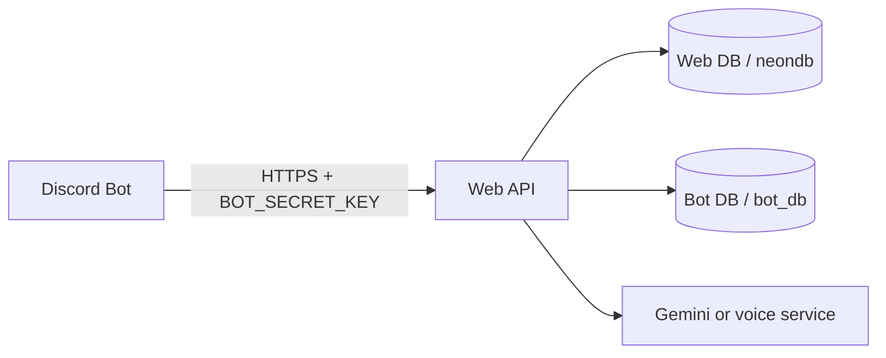

# Seline AI DB and API Guide

이 문서는 Discord 봇이 웹 서버 API를 통해 사용자 설정, 동의, 장기기억, 크레딧을 사용하는 방법을 설명합니다.

## 1. 전체 구조



권장 구조는 봇이 Neon DB에 직접 접속하지 않고 웹 API만 호출하는 방식입니다.

## 2. 두 DB의 역할

### Web DB: `neondb`

웹 회원과 사용자 단위 설정을 저장합니다.

- `users`, `user_accounts`: 웹 사용자와 Discord 계정 연결
- `user_profiles`: 이름, 닉네임, 성별, 생년월일, locale
- `user_consents`: 서비스 이용약관, 개인정보, 국외 이전, 장기기억 동의
- `language_settings`: 언어와 시간대
- `memory_settings`: 장기기억 사용 여부와 보관 기간
- `text_style_settings`: 말투, 관계 톤, 답변 길이, 선호/금지 주제
- `voice_behavior`: 음성 응답, 음성 스타일, 속도, 볼륨, 끼어들기 설정
- `voice_consents`: 음성 인식 동의
- `credit_balances`: 크레딧 잔액
- `model_usage_events`: 모델 사용량과 차감 기록

### Bot DB: `bot_db`

Discord 서버와 대화 실행에 필요한 봇 데이터를 저장합니다.

- `conversation_turns`: 최근 사용자/AI 대화
- `conversation_summaries`: 대화 요약
- `user_memories`: 장기기억 내용, 신뢰도, 고정 여부, 삭제/만료 정보
- `memory_audit_events`: 기억 고정, 삭제, 초기화 기록
- `guild_settings`: 서버별 자동/수동 음성 입장 설정
- `channel_voice_permissions`: 서버/채널별 음성 허용 여부
- `performance_events`: STT, LLM, TTS 처리시간과 성공/실패 이벤트
- `voice_sessions`: 음성 세션 요약 정보

두 DB 사이에 PostgreSQL 외래키는 없습니다. 연결은 다음 논리 키로 합니다.

```text
Discord ID
  -> Web DB user_accounts.provider_user_id
  -> Web DB users.id
  -> Bot DB의 user_id
```

## 3. 봇 환경변수

```env
# A의 배포된 웹 API 주소. URL이지 비밀키가 아닙니다.
BOT_API_BASE_URL=https://anime-discord-bot-rw3b.vercel.app

# Vercel의 BOT_SECRET_KEY와 같은 값
BOT_SECRET_KEY=<actual BOT_SECRET_KEY>

# Discord Developer Portal 값
DISCORD_TOKEN=<Discord bot token>
DISCORD_CLIENT_ID=<Discord application ID>
```

직접 DB 접속이 꼭 필요한 코드일 때만 아래를 추가합니다. 일반적인 봇 기능에는 필요하지 않습니다.

```env
WEB_DATABASE_URL=<web DB connection string using the restricted kor_ch role>
BOT_DATABASE_URL=<bot DB connection string using the restricted kor_ch role>
```

`NEXTAUTH_SECRET`, `GOOGLE_CLIENT_SECRET`, DB owner 계정, API 키를 봇 프로젝트에 복사하지 마세요.

## 4. 인증 헤더

대부분의 봇 API는 다음 중 하나를 사용합니다.

```http
Authorization: Bearer <BOT_SECRET_KEY>
Content-Type: application/json
```

또는:

```http
x-bot-api-key: <BOT_SECRET_KEY>
```

`/api/bot/consent`는 현재 `x-bot-api-key` 사용을 권장합니다.

## 5. 주요 API

Base URL은 다음과 같습니다.

```text
https://anime-discord-bot-rw3b.vercel.app
```

### 5.1 사용자/서버 설정 확인

```http
GET /api/bot/settings?discordUserId=<DISCORD_USER_ID>&guildId=<GUILD_ID>&channelId=<CHANNEL_ID>
```

웹 DB의 사용자 설정과 봇 DB의 서버/채널 설정을 한 번에 반환합니다. 필수 약관 동의가 없으면 `403 REQUIRED_CONSENT_MISSING`입니다.

### 5.2 필수 동의 확인

```http
GET /api/bot/consent?discordUserId=<DISCORD_USER_ID>
x-bot-api-key: <BOT_SECRET_KEY>
```

`terms`, `privacy`, `overseas`, `memory`가 모두 허용되어야 채팅과 음성 처리를 진행합니다.

### 5.3 대화 전처리와 응답 요청

```http
POST /api/bot/turn
Authorization: Bearer <BOT_SECRET_KEY>
Content-Type: application/json
```

```json
{
  "discordUserId": "123456789012345678",
  "guildId": "guild-001",
  "channelId": "channel-001",
  "messageId": "message-001",
  "inputType": "text",
  "text": "오늘 있었던 일을 기억해줘",
  "characterId": "seline",
  "locale": "ko-KR"
}
```

필수 필드는 `discordUserId`와 `text`입니다. `guildId`와 `channelId`는 서버별 설정과 채널별 최근 대화를 위해 반드시 보내는 것을 권장합니다.

응답 코드:

- `200`: 설정/동의/크레딧 확인 완료
- `401`: API 키 오류
- `403`: Discord 연결 또는 필수 동의 부족
- `402 CREDIT_INSUFFICIENT`: 크레딧 부족. 모델 호출을 중단

현재 이 웹 API의 기본 응답은 fallback 응답일 수 있습니다. 실제 Gemini 호출은 봇 또는 별도 모델 서비스가 `modelInput`을 사용해 수행하도록 연결해야 합니다.

### 5.4 크레딧 잔액 확인

```http
GET /api/bot/credits?discordUserId=<DISCORD_USER_ID>
Authorization: Bearer <BOT_SECRET_KEY>
```

응답 예시:

```json
{
  "ok": true,
  "userId": 12,
  "balance": 97,
  "canUse": true
}
```

크레딧은 Web DB의 `credit_balances`에 저장됩니다. Bot DB에 저장하지 않습니다.

### 5.5 크레딧 차감

실제 모델 호출 직전에 차감합니다.

```http
POST /api/bot/credits
Authorization: Bearer <BOT_SECRET_KEY>
Content-Type: application/json
```

```json
{
  "discordUserId": "123456789012345678",
  "amount": 1
}
```

`200`이면 모델 호출을 진행하고, `402 CREDIT_INSUFFICIENT`이면 호출하지 않습니다. DB의 원자적 차감으로 잔액은 0 아래로 내려가지 않습니다.

### 5.6 장기기억 조회/저장/고정

```http
GET /api/bot/memory?discordUserId=<DISCORD_USER_ID>
POST /api/bot/memory
PATCH /api/bot/memory
```

저장:

```json
{
  "discordUserId": "123456789012345678",
  "content": "사용자는 딸기 케이크를 좋아한다."
}
```

고정/해제:

```json
{
  "discordUserId": "123456789012345678",
  "memoryId": 42,
  "pinned": true
}
```

필수 동의가 없으면 `403`입니다. 봇은 `user_memories`를 직접 조작하기보다 이 API를 사용해야 합니다.

### 5.7 음성 동의

```http
POST /api/bot/voice-consent
Authorization: Bearer <BOT_SECRET_KEY>
Content-Type: application/json
```

```json
{
  "discordUserId": "123456789012345678",
  "enabled": true
}
```

음성 입력 전에 `/api/bot/settings` 또는 `/api/bot/consent` 결과를 확인하고, 음성 동의가 `true`가 아니면 STT와 TTS를 실행하지 않습니다.

### 5.8 처리 이벤트와 모델 사용량

```http
POST /api/bot/metrics
Authorization: Bearer <BOT_SECRET_KEY>
Content-Type: application/json
```

STT 예시:

```json
{
  "eventType": "stt",
  "discordUserId": "123456789012345678",
  "guildId": "guild-001",
  "channelId": "channel-001",
  "durationMs": 840,
  "success": true,
  "emptyText": false
}
```

LLM 사용량 예시:

```json
{
  "eventType": "llm",
  "discordUserId": "123456789012345678",
  "durationMs": 2100,
  "success": true,
  "modelUsage": {
    "model": "<model-name>",
    "inputTokens": 420,
    "outputTokens": 180,
    "creditsUsed": 1
  },
  "creditAlreadyConsumed": true
}
```

`/api/bot/credits`에서 먼저 차감했다면 `creditAlreadyConsumed: true`를 보내 중복 차감을 막습니다. 먼저 차감하지 않고 metrics만 보내는 방식은 운영 흐름으로 권장하지 않습니다.

## 6. 권장 처리 순서

1. Discord 이벤트에서 `discordUserId`, `guildId`, `channelId`, `text`를 얻습니다.
2. `/api/bot/settings`를 호출합니다.
3. `403`이면 동의나 Discord 연결 문제이므로 중단합니다.
4. 음성 입력이면 `voiceConsent`가 true인지 확인합니다. 아니면 STT/TTS를 실행하지 않습니다.
5. `/api/bot/turn`을 호출합니다.
6. `401`, `403`, `402`이면 모델 호출을 하지 않습니다.
7. `/api/bot/credits`에 `amount`를 보내 크레딧을 원자적으로 차감합니다.
8. 차감 성공 후 Gemini 또는 음성 모델을 호출합니다.
9. 결과를 Discord로 전송합니다.
10. STT/LLM/TTS 처리 결과를 `/api/bot/metrics`로 보냅니다.
11. 사용자가 기억을 요청한 경우에만 `/api/bot/memory`에 저장합니다.

## 7. PowerShell 테스트 예시

```powershell
$base = "https://anime-discord-bot-rw3b.vercel.app"
$key = $env:BOT_SECRET_KEY
$discordUserId = "123456789012345678"

$headers = @{
  Authorization = "Bearer $key"
  "Content-Type" = "application/json"
}

# 잔액 확인
Invoke-RestMethod `
  -Uri "$base/api/bot/credits?discordUserId=$discordUserId" `
  -Headers $headers

# 크레딧 1개 차감
$creditBody = @{ discordUserId = $discordUserId; amount = 1 } | ConvertTo-Json
Invoke-RestMethod `
  -Uri "$base/api/bot/credits" `
  -Method POST `
  -Headers $headers `
  -Body $creditBody
```

키를 명령어에 직접 적거나 GitHub에 올리지 마세요. 테스트 전 PowerShell에서만 `$env:BOT_SECRET_KEY`로 넣습니다.

## 8. 운영 시 주의사항

- API 키, Discord 토큰, Gemini 키, DB 비밀번호는 문서와 Git에 저장하지 않습니다.
- 원본 음성 파일과 실시간 음성 버퍼는 DB에 저장하지 않습니다.
- 처리 이벤트는 숫자와 성공/실패 중심으로만 저장하고 7~14일 후 정리합니다.
- 오래된 `/v1/discord/...` 경로가 아니라 현재 `/api/bot/...` 경로를 사용합니다.
- API가 정상 응답해도 실제 모델 호출은 봇의 Gemini/음성 서비스 설정이 별도로 되어 있어야 합니다.
